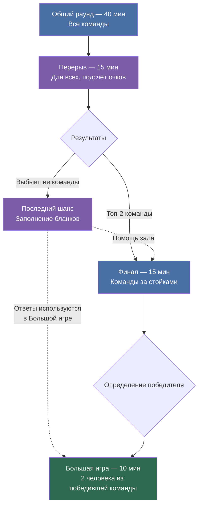

# Игра 100 к 1

100 к 1 - это популярная российская телеигра по типу Family Feud.
Две команды угадывают самые распространённые ответы на необычные вопросы, которые раньше задавали прохожим.

## Параметры

| Параметр | Значение |
|---|---|
| Дата | 17.10.26 |
| Аудитория | не забронирована |
| Участники | ~50 человек (до 70 регистраций) |
| Состав команды | По 5-6 человек, примерное одинаковое количество координаторов и старост |
| Длительность | ~1.5 часа |

---

## План проведения игры

### Общий раунд

| Параметр | Значение |
|---|---|
| Длительность | 40 минут |
| Участники | Все команды на местах за столами |
| Формат | Мини раунды внутри |

Командам выдаются бланки на каждый мини раунд, где они отвечают на заданный вопрос (вопросы).
Ведущий озвучивает вопрос, командам даётся время на подумать и написать ответы,
после каждого мини раунда собираются бланки, ведущий озвучивает ответы.
Ответы команд проверяются на смысловое совпадение, а не дословное, с ответами из опроса.

#### Мини раунды

##### Одиночная игра

- 1 бланк, 2 вопроса.
- На каждый вопрос команде предлагается дать (написать в бланке) 6 ответов.
- Проверяется каждый из этих ответов.
- Если ответ присутствует в топ-6 ответов на этот вопрос в опросе (Далее топ-\* в опросе),
  то за этот ответ команда получает столько очков, сколько человек ответило также в опросе.
- 2 минуты на каждый вопрос.

##### Двойная игра

- Правила те же, что и в Одиночной игре,
  за исключением того, что команды по итогам этого раунда получают **двойные баллы**.

##### Продолжи фразу

- 1 бланк, 2 вопроса.
- Ведущий озвучивает начало фразы.
- Командам необходимо написать 3 варианта продолжения фразы.
- За каждый ответ, совпавший по смыслу с ответами из опроса, команда получает количество очков,
  соответствующее популярности этого ответа.
- 2 минуты на каждый вопрос.

##### Кто это сказал? //можно заменить на "Из какого это чата сообщение?" - на экране показывать сообщение (чат группы, старост, профоргов ...) и ответы будут не на бланках, а кто первый поднимет руку 

- Ведущий озвучивает необычную фразу или ответ, связанный со студенческой жизнью.
- Командам необходимо угадать, какой ответ из опроса подходит к этой фразе.
- Можно использовать формат с несколькими вариантами ответов или угадывание самого популярного ответа.
- За правильный ответ команда получает баллы согласно популярности ответа в опросе.
- 1 бланк, 2 вопроса.

##### Блиц

- 1 бланк, 3 вопроса, по 20 секунд на вопрос.
- На каждый вопрос нужно написать 2 ответа.
- За каждый ответ, совпавший с ответом из опроса, команда получает соответствующее количество очков.

##### Запрещённый ответ

- 1 бланк, 2 вопроса.
- Из полученных из опроса ответов выбирается один из первых пяти популярных,
  он отмечается как запрещённый.
- Нужно дать 2 ответа на вопрос.
- Если один из двух ответов команды является запрещённым,
  то за этот вопрос команда получает **-25 баллов**.
- За каждый правильный ответ, который входит в пятёрку популярных ответов,
  команда получает **+25 баллов**.
- Если оба ответа правильные и ни один не является запрещённым,
  команда получает **+50 баллов**.

#### Фичи для каждой команды на игру

- **Удвоение баллов за раунд** (как в +, так и в -):
  - Каждая команда получает одну возможность удвоить баллы за любой мини раунд.
  - Удвоение необходимо активировать до начала раунда.
  - После использования возможность сгорает.

---

### Перерыв

| Параметр | Значение |
|---|---|
| Длительность | 15 минут |
| Участники | Все команды |
| Цель | Подсчёт очков организаторами |

После общего раунда команды, набравшие наименьшее количество очков (не попавшие в топ-2), выбывают.
Они могут смотреть из зала за играми в финале, а также участвовать в специальных активностях.
Во время финала они будут участвовать в специальном опросе «Последний шанс».

---

### Финал

| Параметр | Значение |
|---|---|
| Длительность | 15 минут |
| Участники | 2 команды с наибольшим количеством очков |
| Расположение | За стойками (столы около сцены) |
| Формат | 1-2 мини раунда |

Этот раунд проводится в таком же виде, как в оригинальной игре.

#### Мини раунды

##### Тройная игра

- Правила те же, что и в Одиночной игре,
  за исключением того, что команды по итогам этого раунда получают **тройные баллы**.

##### Игра наоборот

- Ведущий задаёт вопрос, на который команды должны назвать ответы.
- В отличие от обычной игры, команда получает баллы за самые **непопулярные** ответы.
- Чем меньше человек ответило так в опросе, тем больше очков получает команда.
- Используются топ-6 ответов с ненулевыми баллами.
- Команды по очереди называют ответы.

#### Примечание

- Если по итогам финала команды набрали одинаковое количество очков,
  проводится дополнительный вопрос.
- Команды по очереди называют ответы по правилам как в оригинальной игре.
- Побеждает команда, чей ответ набрал больше баллов. Эта команда побеждает во всей игре 100 к 1.

#### Для выбывших команд

##### Последний шанс

- Каждая выбывшая команда получает бланк с 5 вопросами про студенческую жизнь,
  Бауманку или само мероприятие.
  За 3 минуты команда должна написать по одному наиболее популярному, на её взгляд,
  ответу на каждый вопрос.
- Организаторы собирают бланки.
  Организаторы объединяют одинаковые по смыслу ответы и
  в оставшееся время финала подсчитывают,
  сколько команд назвали каждый вариант.
- Получившийся рейтинг ответов используется в большой игре.
  За каждый ответ команда получает столько очков, сколько выбывших команд назвали такой же ответ.
- Таким образом, выбывшие команды получают возможность повлиять на большую игру,
  а 2 участника большой игры должны угадывать ответы выбывших команд.

##### Взаимодействие с командами, играющими финал

- У команд, играющих в финале в тройную игру и игру наоборот есть
  возможность 1 раз за раунд взять помощь зала (выбывших команд),
  они высказывают свои предположения, а команда решает давать ли такой ответ.

---

### Большая игра

| Параметр | Значение |
|---|---|
| Длительность | 10 минут |
| Участники | 2 человека из победившей команды |
| Состав | Староста и координатор |

- Этот раунд уже больше просто развлекательный, либо если будет возможность,
  то эти 2 человека получат особенные призы.
- Двум участникам нужно набрать в сумме определённое количество очков.

---

- Сначала один из них выходит из аудитории в наушниках,
  чтобы он не видел и не слышал, что будет происходить в аудитории.
- У второго участника будет 30 секунд, чтобы ответить на 5 вопросов,
  составленных по итогам опроса выбывших команд в перерыве.
- После этого первый участник возвращается и отвечает на те же 5 вопросов,
  не слыша ответы второго участника.
- Если первый участник повторяет ответ второго,
  ведущий просит назвать другой ответ.
- За каждый ответ, совпавший с ответом из опроса выбывших команд,
  команда получает столько очков, сколько выбывших команд назвали такой же ответ.
- В процессе того как участники отвечают на вопросы,
  организаторы сравнивают их ответы с ответами выбывших команд и подсчитывают баллы.

---

## Структура игры

---

## Подготовка к мероприятию

### Опросить студентов Бауманки

- Составить список вопросов, которые будут использоваться в игре, составить гугл форму.
- Опрашивать нужно только студентов, которые точно не придут на мероприятие,
  то есть не координаторов и не старост.
- Возможные варианты опроса:
  - Опрашивать студентов в коридорах Бауманки (приоритетно).
  - Рассылать опрос среди знакомых (не старост и не координаторов).
- Подготовить отдельные 5 вопросов для опроса выбывших команд.

### Набрать организаторов!!!

| Роль | Количество |
|---|---|
| Проверка бланков | 3 чел. |
| Сбор бланков | 3 чел. |
| Показ презентации | 1 чел. |
| Ведущие | 1-2 чел. |

- Организаторы могут быть привлечены для составления
  списка вопросов к раундам, застройки и уборки.

### Забронировать аудиторию!

Желательные варианты:
- Конгресс (417к, Материя)
- 345ю ГЗ

### Сделать запрос в ТО

Будут нужны:
- Экраны для презентации
- Колонки
- Микрофоны
- Микшер + человек, который будет обеспечивать настройку музыки на мероприятии

### Сделать запрос в Медиа

- Нужен как минимум один СММщик + фотик (по возможности)

### Попробовать договориться с внешкой

- Поиска партнёров, призы от которых смогут получить выигравшие команды

### Прочее

- Подготовить бланки для общего раунда и опроса выбывших команд.
- Подготовить таблицу с ответами из опроса и количеством голосов.
- Подготовить презентацию с вопросами и ответами
  (желательно интерактивную презентацию, чтобы можно было сделать таймер).
- Назначить ведущего и организаторов, ответственных за сбор бланков и подсчёт очков.

---

## Список вопросов

. Одиночная игра — 10 вопросов
1. Что студент Бауманки чаще всего делает перед парой, к которой не подготовился?
2. Какую фразу чаще всего можно услышать от студента после тяжёлой пары?
3. Что студент Бауманки берёт с собой на пары?
4. Как студенты называют ситуацию, когда дедлайн уже сегодня, а работа ещё не начата?
5. Где студент скорее всего проведёт свободное окно между парами?
6. Что студент делает, когда понимает, что преподаватель сегодня будет спрашивать?
7. Какая причина чаще всего используется, чтобы объяснить опоздание на пару?
8. Что студент Бауманки делает в ночь перед экзаменом?
9. Что можно чаще всего увидеть на столе студента во время сессии?
10. Какая мысль первой приходит студенту после получения расписания на семестр?

2. Двойная игра — 5 вопросов
1. Что студент делает сразу после последней пары в пятницу?
2. Какой предмет студенты чаще всего откладывают «на потом»?
3. Что помогает студенту пережить тяжёлую неделю?
4. Что студент говорит, когда получает неожиданно низкий балл?
5. Что обычно происходит за 10 минут до дедлайна?

3. Продолжи фразу — 5 вопросов
Здесь лучше делать начала, которые могут закончиться очень разными, но популярными вариантами.
1. «Если бы я знал, что сегодня будет эта пара, я бы…»
2. «После этой сессии я точно…»
3. «Настоящий студент Бауманки никогда не…»
4. «Когда преподаватель говорит „это будет на экзамене“, я…»
5. «Моя жизнь изменилась после того, как я…»

???

5.  Бауманский блиц — 20 вопросов
1. Назови два корпуса Бауманки.
2. Назови два предмета, которые ассоциируются с первым курсом.
3. Назови два самых популярных места в Бауманке.
4. Назови две вещи, которые студент берёт на ШМБ.
5. Назови два места, где студент может поспать между парами.
6. Назови два места, где самые большие очереди.
7. Назови два предмета, которые студенты считают сложными.
8. Назови две вещи, которые делал каждый первокурсник.
9. Назови две причины не прийти на первую пару.
10. Назови два напитка, которые помогают пережить сессию.
11. Назови два типа студентов в группе.
12. Назови две вещи, которые можно найти в рюкзаке студента Бауманки.
13. Назови два способа узнать, что перед вами студенты ИУ.
14. Назови две фразы преподавателя, после которых студентов с каждой лекцией будет меньше.
15. Назови две вещи, которые студент делает сразу после сдачи экзамена.
16. Назови два места, где студенты могут обсуждать домашку.
17. Назови две приметы Бауманки.
18. Назови два признака приближения сессии.
19. Назови два слова, которые лучше всего описывают жизнь студента Бауманки.
20. Назови две вещи, которые студент обещает себе сделать после сессии.

6. Запрещённый ответ — 5 вопросов
1. Назови популярный предмет у студентов Бауманки.
2. Назови место, где можно встретить студента между парами.
3. Назови причину опоздания на пару.
4. Назови вещь, которую студент берёт на экзамен.
5. Назови то, что студент делает вместо подготовки к экзамену.

7. Тройная игра — 5 вопросов
1. Что студент делает, когда до дедлайна осталось 30 минут?
2. Что чаще всего обсуждают студенты после экзамена?
3. Что можно услышать в аудитории перед началом экзамена?
4. Что студент обещает себе после тяжёлой сессии?
5. Что может неожиданно испортить студенту день?

8. Игра наоборот — 5 вопросов
1. Назови причину, по которой студент НЕ хочет идти на первую пару.
2. Назови место в Москве, где студент Бауманки НЕ хотел бы оказаться после пар.
3. Назови предмет, который студент скорее всего НЕ назовёт своим любимым.
4. Назови вещь, которую студент НЕ хотел бы увидеть в сообщении от преподавателя.
5. Назови то, чем студент точно НЕ хочет заниматься в ночь перед экзаменом.

9. Финал — 5 вопросов
1. Что студент делает, когда узнаёт, что завтра экзамен?
2. Что помогает пережить сессию?
3. Что студент чаще всего забывает перед экзаменом?
4. Какая фраза преподавателя пугает студентов больше всего?
5. Что студент делает сразу после успешной сдачи последнего экзамена?

ё
